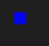

# CPPND: Capstone Super Snake

This is the assignment repo for the Capstone project in the [Udacity C++ Nanodegree Program](https://www.udacity.com/course/c-plus-plus-nanodegree--nd213). The code for this repo was inspired by [this](https://codereview.stackexchange.com/questions/212296/snake-game-in-c-with-sdl) excellent StackOverflow post and set of responses.

Serveral features have been added to the original snake game. Including 

* Two additional non-food collectables (marijuana and coffee)
* Corresponding two abnormal mental status (get crazy and calm) 
* A cool down bar indicating the time left before the abnornal status ends
* A concurrent thread that spawns non-food collectables

## Collectables

| Collectable | Score | Status | Description                                                                         | Thumbnails |
|-------------|-------|--------|-------------------------------------------------------------------------------------|------------|
| Food        | 10    |        | The length of the snake increases by 1                                              |            |
| Marijuana   | 50    | Crazy  |      The length of the snake increases by 5, its speed increases by 2 times in 5 seconds    |              |
| Coffee      | 0     | Chill  |  The speed decreases by half in 10 seconds   |             |

## Files and Classes Structures

Expected behavior: the cool down bar presented whenever the snake eats a non-food collectable, with corresponding effect on the score and the speed.

## Rubrics
* The project uses Object Oriented Programming techniques.
* Classes use appropriate access specifiers for class members.
* Class constructors utilize member initialization lists. (collectable.cpp:9, cooldown:13)
* Classes abstract implementation details from their interfaces. 
(food, marijuana, coffee, cooldown bar and the snake are inheritance from an interface class, renderable)

* Classes encapsulate behavior. 
* Classes follow an appropriate inheritance hierarchy.
* Derived class functions override virtual base class functions. (Collectable cooldown and snake overrides different RENDER method to render differently, renderable.h:13)
* The project makes use of references in function declarations. (game.h:24 Run() function takes in references to the controller and renderer)
* The project uses multithreading. (a concurrent thread responsible for spawning non-food collectable aysncronously game.cpp:29)
* Mutex and CV are used to protect collectables (ie. std::vector<Collectable> should be protected when adding and removing elements)

## Dependencies for Running Locally
* cmake >= 3.7
  * All OSes: [click here for installation instructions](https://cmake.org/install/)
* make >= 4.1 (Linux, Mac), 3.81 (Windows)
  * Linux: make is installed by default on most Linux distros
  * Mac: [install Xcode command line tools to get make](https://developer.apple.com/xcode/features/)
  * Windows: [Click here for installation instructions](http://gnuwin32.sourceforge.net/packages/make.htm)
* SDL2 >= 2.0
  * All installation instructions can be found [here](https://wiki.libsdl.org/Installation)
  * Note that for Linux, an `apt` or `apt-get` installation is preferred to building from source.
* gcc/g++ >= 5.4
  * Linux: gcc / g++ is installed by default on most Linux distros
  * Mac: same deal as make - [install Xcode command line tools](https://developer.apple.com/xcode/features/)
  * Windows: recommend using [MinGW](http://www.mingw.org/)

## Basic Build Instructions

1. Clone this repo.
2. Make a build directory in the top level directory: `mkdir build && cd build`
3. Compile: `cmake .. && make`
4. Run it: `./SnakeGame`.